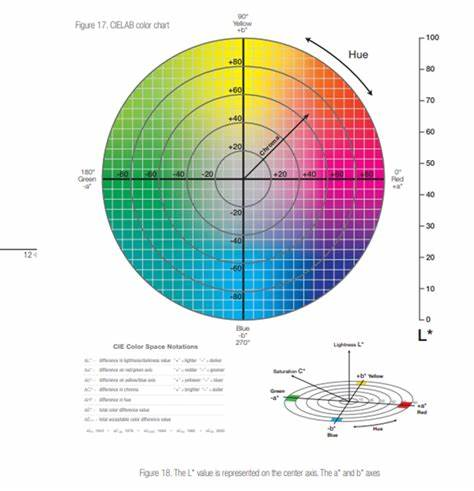
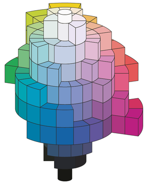

```python
from skimage.color import rgb2lab
from skimage.io import imshow

img=load_img('img/pic.jpg')
cielab_img = rgb2lab(img)

# decoding CIELAB color dimensions
L=cielab_img[:,:,0] 
A=cielab_img[:,:,1]
B=cielab_img[:,:,2]

imshow(L)  # black and white image / "lightness values" (0:100)
imshow(A)  # green to red (-127:+128)
imshow(B)  # blue to yellow (-127:+128)
```

## CIELAB color format
- L: lightness
- A: green - red
- B: blue - yellow





<!-- Start by normalize A/B vectors (0:1) -->

autoencoder architrcure:
- Encode L vector
- Decode A/B vectors
- Add decoded A/B to L to produce color image


<!-- https://www.youtube.com/watch?time_continue=1234&v=EujccFRio7o&embeds_referring_euri=https%3A%2F%2Fwww.bing.com%2F&embeds_referring_origin=https%3A%2F%2Fwww.bing.com&source_ve_path=MjM4NTE&feature=emb_title -->

